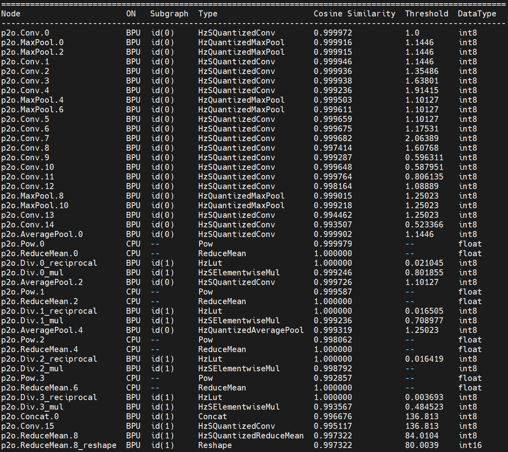

# 1. Background Introduction

**LPRNet** (License Plate Recognition Network) is a deep learning model specifically designed for&#x20;**&#x20;license plate recognition&#x20;**&#x20;(License Plate Recognition, LPR). It was proposed by NVIDIA, with the goal of achieving end-to-end license plate recognition, no longer relying on traditional segmentation and character detection, but directly predicting character sequences from license plate images.&#x20;

## 1.1 Model Features

**End-to-end**: Input license plate images and directly output license plate character sequences.

**No character segmentation required&#x20;**: Traditional methods need to first locate characters and then classify them, while LPRNet uses&#x20;**&#x20;sequence learning&#x20;**&#x20;to directly recognize.&#x20;

**Lightweight and efficient**: Lighter than conventional CNN+RNN models, suitable for real-time applications (such as embedded devices, in-vehicle systems).

**CTC Loss**: Uses **Connectionist Temporal Classification (CTC)** to address the alignment issue between the predicted length and the true character sequence.

## 1.2 Network Structure

The core of LPRNet is a convolutional neural network that removes the recurrent layer and uses&#x20;**&#x20;width-wise convolution&#x20;**&#x20;to capture sequential features. The overall structure is roughly as follows:&#x20;

**Input**: License plate image (e.g., normalized to `94×24`).

**Feature Extraction Backbone**: A series of convolution and residual blocks that gradually extract spatial features.

**Feature Compression**: Through convolution in the width direction, features are mapped into something similar to a "time series".

**Character Prediction Layer&#x20;**: Uses a fully connected layer or 1×1 convolution to output the character probability distribution at each "time step".&#x20;

**CTC Decoding**: Combining greedy or beam search algorithms, maps the output probabilities to the final license plate character sequence.


The simplified structural process is:&#x20;


## 1.3 ONNX Model


As can be seen from the figure above, the main operators include conventional operators such as Conv, BatchNorm, and RELU. These conventional operators are all supported on the RDK X5. Subsequently, we deployed this model on the RDK X5.&#x20;

# 2. BPU quantization precision

We choose to use int8 quantization in the process of the RDK X5 toolchain.

We can see the layer-by-layer quantization accuracy:&#x20;



**Final quantization accuracy: 0.9973**


# 3. RDK X5 Deployment&#x20;

## 3.1 Performance of the upper board of the model

After completing the steps of the toolchain, we obtain a model in.bin format, which is a Digua heterogeneous model and supports the use of Digua BPU computing power.&#x20;

We overclock the RDK X5 before the test:

```bash
# 8核心CPU全核心1.8GHz，Performance调度
sudo bash -c "echo 1 > /sys/devices/system/cpu/cpufreq/boost"
sudo bash -c "echo performance > /sys/devices/system/cpu/cpufreq/policy0/scaling_governor"
# BPU超频到1.2GHz
echo 1200000000 > /sys/kernel/debug/clk/bpu_mclk_2x_clk/clk_rate
```

We use the hrt\_model\_exec tool to perform model performance testing.

```plain&#x20;text
hrt_model_exec perf --model_file lpr.bin --thread_num 1
```

We use the parameter thread\_num to adjust the number of threads and obtain different results&#x20;

Finally, the following table is obtained:

| Number of threads | Total frame number | Total Delay (ms) | Average Delay (ms)  | FPS     |
| ----------------- | ------------------ | ---------------- | ------------------- | ------- |
| 1                 | 200                | 745.53           | 3.72                | 267.61  |
| 2                 | 200                | 771.41           | 3.85                | 516.33  |
| 4                 | 200                | 814.83           | 4.07                | 971.23  |
| 8                 | 200                | 1112.61          | 5.56                | 1403.01 |

## 3.2 Model upper plate accuracy

For CPU models, no point drop was found in all 50 test data samples.&#x20;

Take the following image as an example:&#x20;


BPU Recognition Result:&#x20;


The result is completely correct&#x20;

## 3.3 Other Indicators

**BPU Occupancy: 9%&#x20;**

.PNG)

**ION Memory Usage: 1.11MB**

.PNG)

**Bandwidth**:&#x20;

.PNG)


## 3.4 Explanation of the operation of mounting the model on the board

To experience this model, you can visit Nodehub or ModelZoo, find the corresponding repository, and start the experience.&#x20;

Before operating this model, please refer to the README of the Model Zoo of RDK X5&#x20;

https://github.com/D-Robotics/rdk\_model\_zoo

Complete the installation of the bpu\_infer\_lib library.&#x20;

Next, we install the corresponding dependencies:

```plain&#x20;text
pip install -r requirements.txt
```

After completing the installation of relevant dependencies, we can execute&#x20;

```plain&#x20;text
python main.py
```

Obtain the result of license plate image recognition.&#x20;

You can also replace the image path in main.py with another image for testing.&#x20;
