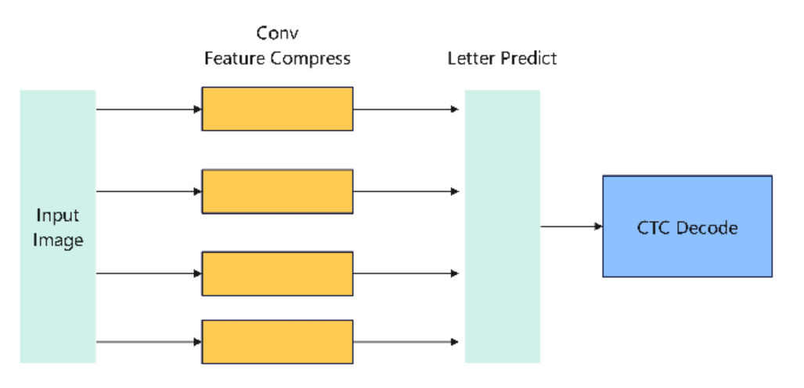
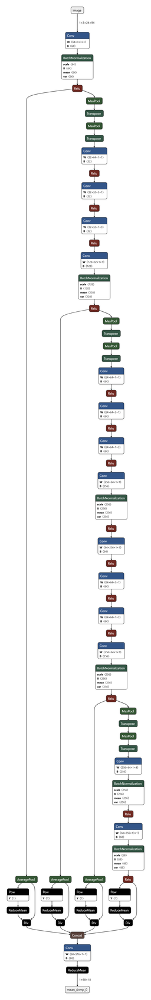
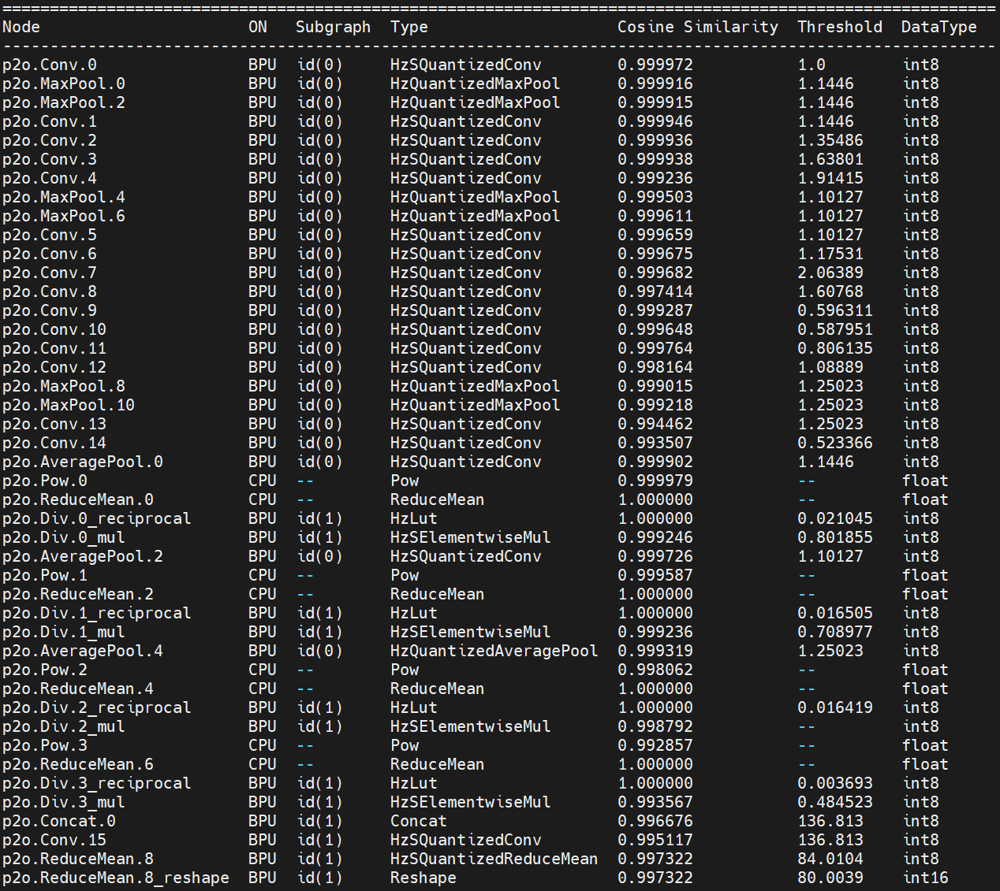
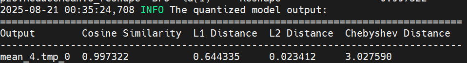
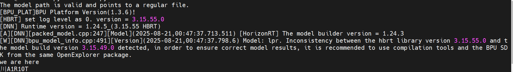

# 1. 背景介绍

**LPRNet**（车牌识别网络）是一种专门为**车牌识别**（License Plate
Recognition, LPR）设计的深度学习模型。该模型由 NVIDIA
提出，目标是实现端到端的车牌识别，不再依赖传统的字符分割和检测，而是直接从车牌图像预测字符序列。

## 1.1 模型特点

**端到端**：输入车牌图像，直接输出车牌字符序列。

**无需字符分割**：传统方法需要先定位字符再分类，而 LPRNet
通过**序列学习**直接识别。

**轻量高效**：比传统的 CNN+RNN
模型更轻量，适用于实时应用（如嵌入式设备、车载系统）。

**CTC Loss**：使用 **连接时序分类（CTC）**
解决预测长度与真实字符序列对齐的问题。

## 1.2 网络结构

LPRNet
的核心是一个卷积神经网络，它去除了循环层，使用**宽度方向卷积**来捕捉序列特征。整体结构大致如下：

**输入**：车牌图像（例如归一化到 `94×24`）。

**特征提取骨干网络**：一系列卷积和残差块，逐步提取空间特征。

**特征压缩**：通过宽度方向的卷积，将特征映射为类似"时间序列"的形式。

**字符预测层**：使用全连接层或 1×1 卷积输出每个"时间步"的字符概率分布。

**CTC 解码**：结合贪心或束搜索算法，将输出概率映射为最终车牌字符序列。

简化的结构流程如下：



## 1.3 ONNX 模型



从上图可以看出，主要算子包括 Conv、BatchNorm、ReLU
等常规算子，这些算子在 RDK X5 上均已支持。随后，我们将该模型部署在 RDK
X5 上。

# 2. BPU 量化精度

在 RDK X5 工具链的过程中，我们选择使用 int8 量化。

可以看到逐层的量化精度：



**最终量化精度：0.9973**



# 3. RDK X5 部署

## 3.1 模型上板性能

完成工具链步骤后，我们得到一个 `.bin`
格式的模型，这是一个地瓜异构模型，支持使用地瓜 BPU 计算力。

在测试前，我们对 RDK X5 进行了超频：

``` bash
# 8 核 CPU 全核心 1.8GHz，Performance 调度
sudo bash -c "echo 1 > /sys/devices/system/cpu/cpufreq/boost"
sudo bash -c "echo performance > /sys/devices/system/cpu/cpufreq/policy0/scaling_governor"
# BPU 超频到 1.2GHz
echo 1200000000 > /sys/kernel/debug/clk/bpu_mclk_2x_clk/clk_rate
```

我们使用 hrt_model_exec 工具进行模型性能测试：

`hrt_model_exec perf --model_file lpr.bin --thread_num 1`

通过参数 thread_num 调整线程数量，得到不同的结果：

| Number of threads | Total frame number | Total Delay (ms) | Average Delay (ms)  | FPS     |
| ----------------- | ------------------ | ---------------- | ------------------- | ------- |
| 1                 | 200                | 745.53           | 3.72                | 267.61  |
| 2                 | 200                | 771.41           | 3.85                | 516.33  |
| 4                 | 200                | 814.83           | 4.07                | 971.23  |
| 8                 | 200                | 1112.61          | 5.56                | 1403.01 |

## 3.2 模型上板精度

在 CPU 模型上，50 个测试样本中未发现掉点。

以下图像为例：


BPU 识别结果：



结果完全正确。

## 3.3 其他指标

**BPU 占用率：9%**

.PNG)

**ION 内存占用：1.11MB**

.PNG)

**带宽**：

.PNG)

## 3.4 模型上板运行说明

要体验该模型，可以访问 Nodehub 或 ModelZoo，找到对应仓库，开始体验。

在操作该模型前，请参考 RDK X5 的 Model Zoo 的 README：

https://github.com/D-Robotics/rdk_model_zoo

完成 bpu_infer_lib 库的安装。

接下来安装相关依赖：

`plain text pip install -r requirements.txt`

安装完成后，可以执行：

`plain text python main.py`

即可获得车牌图像识别结果。

也可以替换 main.py 中的图像路径，测试其他图片。
